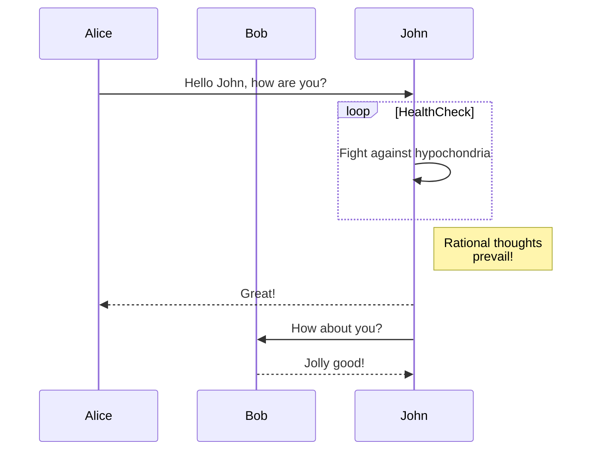

<!-- @_paging: skip -->

# Hello, SlideMd <!-- .text-red-500 .test -->

Make Presentation by Markdown

---

<!-- @class: !bg-blue-100 dark:!bg-gray-500 -->

# Header 1

## Header 2

### Header 3

#### Header 4

##### Header 5

###### Header 6

---

## Paragraphs

I really like using Markdown.I think I'll use it to format all of my documents from now on.
I just love **bold text**.

Italicized text is the *cat's meow*.
This text is ***really important***.

---

<!-- @class: _ -->

## Blockquotes

To create a blockquote, add a > in front of a paragraph.

> Dorothy followed her through many of the beautiful rooms in her castle.

---

## List

1. First item
2. Second item
3. Third item
4. Fourth item
    - Test 1
    - Test 2
    - Test 3

- First item
- Second item
- Third item

* First item
* Second item
* Third item
* Fourth item

---

## Code Block

Inline `Code`

```svelte
<script>
 function greet() {
  alert('Welcome to Svelte!'); // [!code hl]
 }
</script>

<button onclick={greet}>click me</button>

<style>
 button {
  font-size: 2em; /* [!code --] */
  font-size: 3em; /* [!code ++] */
 }
</style>
```

---

## Link

Start using Markdown right now by following along with the [Getting Started](https://www.markdownguide.org/getting-started/) guide. It's designed for everyone, even novices.

<https://www.markdownguide.org>

<fake@example.com>

---

## Image


---

## Background

Image background


---

## Table

| Syntax      | Description |
| ----------- | ----------- |
| Header      | Title       |
| Paragraph   | Text        |

---

## Strikethrough

~~The world is flat.~~ We now know that the world is round.

## Task list

- [x] Write the press release
- [ ] Update the website
- [ ] Contact the media

---

<iframe src="https://svelte.dev/" ></iframe>

---

## Alert

### Classic

> Normal
> Test Normal Alert

### Note

> [!Note]
> Note alert

### Important

> [!Important]
> Important alert

### Tip

> [!Tip]
> Tip alert

---

### Warning

> [!Warning]
> Waning alert

### Caution

> [!Caution]
> caution alert

### Info

>[!Info]
> Info alert

---

### Example

>[!Example]
> Example alert

### Bug

>[!Bug]
> Bug alert

---


